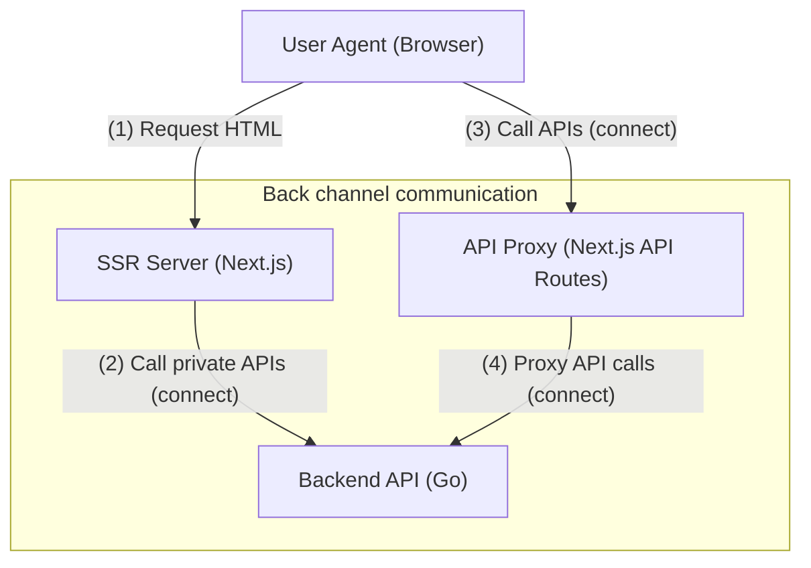

# 【001】High-level Architecture of API Call

## Overview

All backend API is called from the Next.js server and not from user agent (ex. browser javascript).
We define API specification using [Protocol Buffers](https://developers.google.com/protocol-buffers) and generate boilerplate codes using [Connect](https://connect.build/). 

## Background

The modern development process separates the web frontend and backend components.
Therefore, we must define the remote API call procedure while meeting functional and security requirements.

### Goals

- Provide a flow to call the backend API
- Provide a way to write backend API specifications

### Non-Goals

- Determine cloud infrastructure stack
- Determine architecture with the relying parties

## High-level Architecture

High-level architecture consists of 4 components:
- UserAgent (Browser)
- SSR Server ([Next.js](https://nextjs.org/))
- API Proxy ([Next.js API Routes](https://nextjs.org/docs/api-routes/introduction))
- Backend API (Go)

User Agent accesses https://id.p1ass.com and renders HTML pages (1).
SSR server made with Next.js calls private APIs and pass response the data via [`getServerSideProps`](https://nextjs.org/docs/basic-features/data-fetching/get-server-side-props) (2).
Private APIs are allowed access only from the SSR server (back channel communication).

User Agent can call some APIs via API proxy (3).
API Proxy proxies request to backend API (4).
Thanks to API proxy, SSR server and public API can share cookies without specifying `Domain` attributes.
This contributes to [improve security](https://developer.mozilla.org/en-US/docs/Web/HTTP/Cookies).

## Connect - gRPC-compatible RPC with HTTP/1.1

[Connect](https://connect.build/) is the gRPC-compatible RPC and generator of client/server code.
Unlike a gRPC, it works with browsers based on HTTP/1.1 without any proxy like Envoy or gRPC-gateway.

Write API specification using Protocol Buffers, so it is familiar to developers and allows to share API contracts easily.   

## API Client Authorization/Authentication

Backend API authorizes the API client (Next.js server) using OAuth 2.0 Client Credentials [[RFC 6749 Section 4.4]](https://www.rfc-editor.org/rfc/rfc6749#section-4.4).
Client requests APIs with access token and API verifies it is valid.

Backend API authenticates the client using HTTP Basic authentication scheme.
Client id and client secret are used as a credential because API client behaves as a [confidential client](https://www.rfc-editor.org/rfc/rfc6749#section-2.3). 